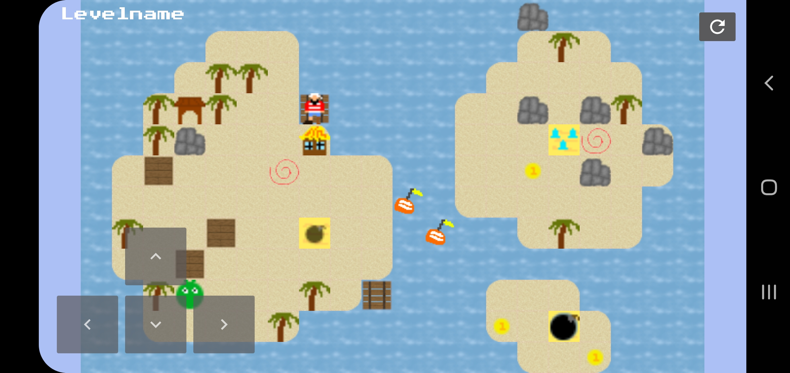
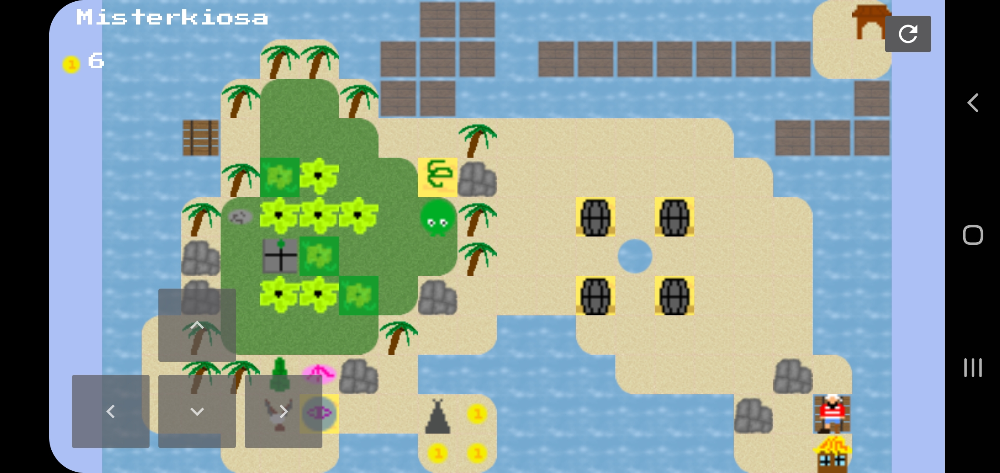
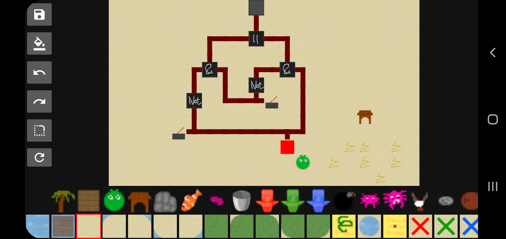

# Pushy-Island

> [!NOTE]  
> Disclaimer: Based on the game _Pushy Island_ from <a href="http://www.lws9.de/">Lernwerkstatt</a>. No original code was used.

## Screenshots






## Features

### New entities not available in the original game

I implemented all entities from the original game. Additionally to that I added some new entities. They are mostly logic gates (AND / OR / XOR).

### Campaign

All original level can be played in the game. Additionally I added some new level with my new entities to the campaign.

### Editor

With the editor you can create your own level. It supports these functionalities:

- undo / redo
- fill
- erase
- auto smoothing corners
- reset

After you validated your level by completing it on your own you have to option to share your level with your friends. For that you can click on the share button and select the way you want to share your level. Your friend will receive a "code" which they can enter in their app.

#### Level code version 1

Until today there is only one version for this level code. But if I will change the way levels are encoded I will add a documentation for that version here.

In the version 1 the whole string can be interpreted as a byte string in hexadecimal.

The first byte is the version number. So usually it should be "01", which is equal to 1 in decimal. Afterwards there are 12 (height) _ 20 (width) _ 6 bits (be careful **not** bytes) representing the terrain, followed by 12 _ 20 _ 6 bits representing the entities. So you have to decode the byte string in that range to a binary string and split it where the index mod 6 is 0. Those 6 bits represent a terrain type or entity type (depending on the position ofc.). You can see the "value" of a type <a href="https://github.com/SoWieMarkus/Pushy-Island/blob/main/app/src/main/java/markus/wieland/pushygame/engine/level/TerrainType.java">here (terrain)</a> and <a href="https://github.com/SoWieMarkus/Pushy-Island/blob/main/app/src/main/java/markus/wieland/pushygame/engine/level/EntityType.java">here (entities)</a>. After 20 tiles a new line begins. So the order is like this:

```javascript
01 02 03 04 05 06 07 08 09 10 11 12 13 14 15 16 17 18 19 20
21 22 23 ...
```

The remaining bytes represent the level name. Every byte represents one character. You get the character but just casting the value of the byte to a char.
